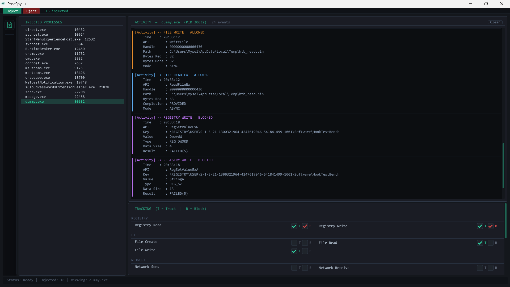
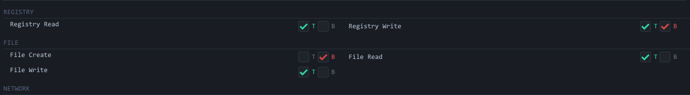
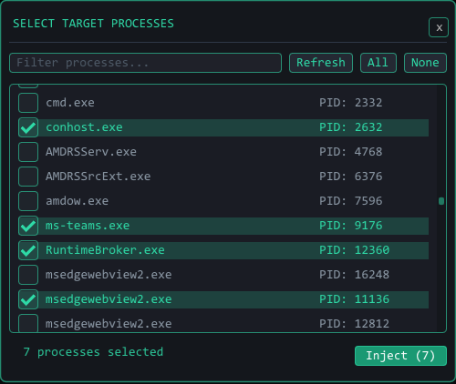
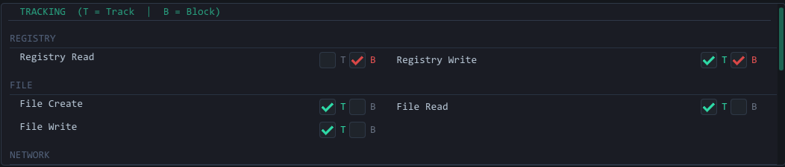
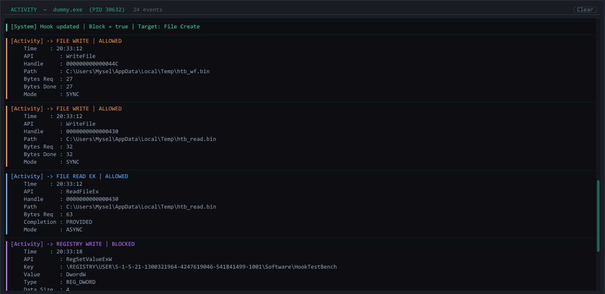
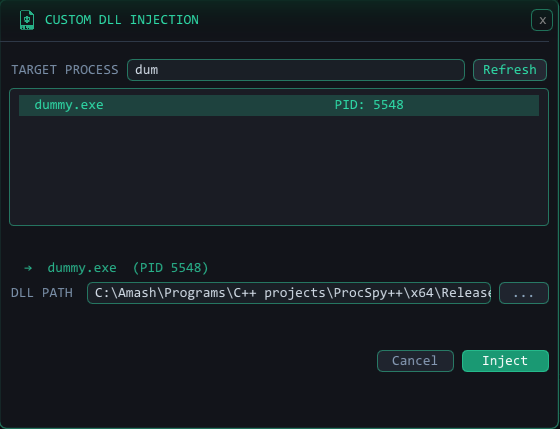
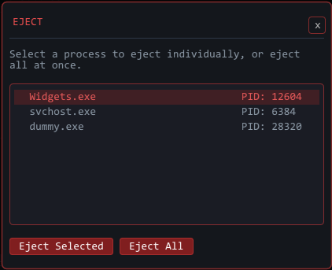

<div align="center">


# ProcSpy++

### Watch what any Windows app is *actually* doing — in real time.



</div>

---

>*AI assisted me to write this readme, and to be honest I took help in GUI part as I was new to ImGUI*

Ever wondered what your apps are secretly doing behind the scenes? Writing files you didn't ask for? Peeking at your clipboard? Sending network packets? **ProcSpy++ lets you find out — and even stop it.**

---

## ⚡ What Can It Do?

ProcSpy++ injects a spy DLL into any running Windows process and intercepts its Windows API calls live. No source code needed. No debugger. Just inject and watch.



You can **track** and **block** all of these:

- 📁 File — Create, Read, Write
- 🗂️ Registry — Read, Write  
- 🌐 Network — Send, Receive
- 🧵 Thread — Creation
- 📦 DLL — Load events
- 📋 Clipboard — Open, Get, Set
- 🖼️ Screenshot — BitBlt capture attempts
- 🪟 Window & Dialog — Creation events

---

## 📥 Download

### Pre-built EXE — Windows 11 x64 tested

Grab it from [**Releases**](../../releases).

> ⚠️ **Your antivirus will flag this.** That's expected — DLL injection looks identical to malware from the AV's point of view. The binary is clean, you'll just need to add an exception.
>
> ⚠️ **It may not work on your PC as-is.** The pre-built binary was compiled on a specific machine. If it crashes, it's almost certainly a DLL mismatch. Also antiviruses dont trust unsigned apps (especially these type of tools) **Self-compiling is strongly recommended** — instructions are right below, it takes about 5 minutes.

---

## 🔨 Build It Yourself (Recommended)

Building yourself = DLLs that match your system + no AV drama.

**Requirements:** Visual Studio 2026(Recommended), "Desktop development with C++" workload, Windows SDK 10.0+

```
1. git clone https://github.com/AmashOnBlitz/ProcSpyPlusPlus.git
2. Open ProcSpy++.sln in Visual Studio
3. Build the SpyDll project first  →  produces SpyDll.dll
4. Build the ProcSpy++ project     →  produces ProcSpy++.exe (Usually it chain compiles with ProcSpy++)
5. Ensure SpyDll.dll is in the same folder as ProcSpy++.exe
6. Right-click ProcSpy++.exe → Run as administrator (Recommended)
```

---

## 🚀 How to Use It

### Step 1 — Inject

Click the green **Inject** button in the top bar. A process picker opens.



Filter by name, check the boxes next to your targets, hit **Inject**. The process appears in the left panel — the spy DLL is now live inside it.

---

### Step 2 — Select the Process & Enable Tracking

Click the process name in the left panel to select it. The bottom-right **Tracking Panel** will activate.



Now tick the **T** checkbox next to any API you want to monitor:

- **T** — Track it (every call gets logged to the activity log)
- **B** — Block it (silently prevents the call from working)

> ⚠️ **Nothing will appear in the log until you enable at least one T checkbox.** Tracking is off by default — you choose exactly what to watch.

---

### Step 3 — Watch the Activity Log

Once tracking is enabled, the activity log on the right starts filling up in real time.



Each event type gets its own color — file writes are orange, network is cyan, registry is purple, screenshots are red. You can clear the log anytime with the **Clear** button.

> Try enabling **T** for File Write on Notepad, then hit save. You'll see the exact file path, byte count, and result — every single call that Notepad makes.

---

### Step 4 — Custom DLL Inject 

Click the icon in the left toolbar to open the custom injection dialog. Pick any process, browse to any `.dll`, inject it.



Useful for loading your own payloads into a process for testing.

---

### Step 5 — Eject

When you're done, hit the red **Eject** button. Pick a process or eject everything at once.



The DLL signals itself to stop cleanly before disconnecting.

---

## 🔬 Under the Hood

This is where it gets interesting. ProcSpy++ is two programs pretending to be one.

### The Injector

When you hit Inject:

1. `SpyDll.dll` gets copied to a uniquely-named temp file (so each process gets its own copy, and it auto-deletes on reboot)
2. The target process is opened with `OpenProcess(PROCESS_ALL_ACCESS)`
3. Memory is allocated inside it via `VirtualAllocEx`
4. The DLL path is written in with `WriteProcessMemory`
5. `CreateRemoteThread` is called, pointing at `LoadLibraryA` — the target process loads the DLL itself
6. If that fails (some protected processes block remote threads), it falls back to `QueueUserAPC` — which queues `LoadLibraryA` onto an existing thread in the target

Once loaded, ProcSpy++ creates a named pipe (`\\.\pipe\messagePipeline_<PID>`) and waits for the DLL to connect back.

---

### The Spy DLL

The moment `DllMain` fires inside the target process:

1. A **HookThread** starts and installs API hooks using [MinHook](https://github.com/TsudaKageyu/minhook)
2. A **MessengerThread** starts, connects to the named pipe, and begins streaming log events back to the GUI
3. It listens for commands coming back down the pipe — `Track|File Write`, `Block|Registry Write`, etc.

The DLL only logs a call when its **Track** flag is enabled for that specific API. Sending a `Track|<label>` command over the pipe flips it on; `NoTrack|<label>` turns it off. Same pattern for Block.

---

### The Hooks

MinHook patches the first few bytes of real Windows API functions (like `CreateFileW` inside `kernel32.dll`) with a jump to ProcSpy's hook. The hook:

- Decides whether to let the original call through based on the Block flag
- Calls the original function via a saved trampoline pointer (if not blocked)
- If Track is enabled, formats a detailed log string and pushes it to the message queue
- MessengerThread picks it up and sends it down the pipe to the GUI

Every hooked function covers both `A` (ANSI) and `W` (Unicode) variants. File hooks skip pipe handles to prevent re-entrant deadlocks — the pipe itself uses `ReadFile` and `WriteFile`.

---

### The GUI

Built with **Dear ImGui** over **OpenGL 3 + GLFW**. The main loop runs at up to 20fps and every frame it:

- Drains messages from all active pipe connections and appends them to per-process logs
- Detects disconnected pipes (process exited) and auto-removes them
- Re-renders the entire layout

---

## 📁 Project Structure

```
ProcSpy++/
├── src/
│   ├── main.cpp           Window init + render loop
│   ├── Render.cpp         All ImGui UI + layout logic
│   ├── Injector.cpp       RemoteThread + APC injection
│   └── PipeServer.cpp     Named pipe server (reads events, sends commands)
└── Libraries/
    ├── ImGUI/             Dear ImGui source
    └── glad/              OpenGL loader

SpyDll/
├── src/
│   ├── dllmain.cpp        Entry point, spawns threads
│   ├── HookThread.cpp     MinHook install/uninstall
│   ├── HookMethods.cpp    All hook function implementations
│   ├── APIHook.cpp        Hook state table (track/block flags)
│   ├── CMDHandler.cpp     Parses pipe commands
│   └── messengerThread.cpp Named pipe client + message sender
└── Libraries/
    └── MinHook/           Inline x64 hook engine
```

---

## ⚠️ Disclaimer

ProcSpy++ is a security research and educational tool. Use it only on processes you own or have explicit permission to inspect. The blocking feature can cause crashes or undefined behavior in target apps — use it carefully.

---

## 🛠️ Known Limitations

- Windows only — Win32 Api has been used in this project
- Requires Administrator — for best output, runs without admin rights too!
- Heavily protected processes (anti-cheat engines, certain system processes) will resist injection
- Memory/heap hooks exist in the code but are intentionally disabled — they cause re-entrant deadlocks since the logging itself allocates memory

---

<div align="center">

**If you made it this far — go inject it into Notepad, enable File Write tracking, and hit save.**  
*You'll never look at a save dialog the same way again.*

⭐ **Star the repo if you found it useful!**

</div>
